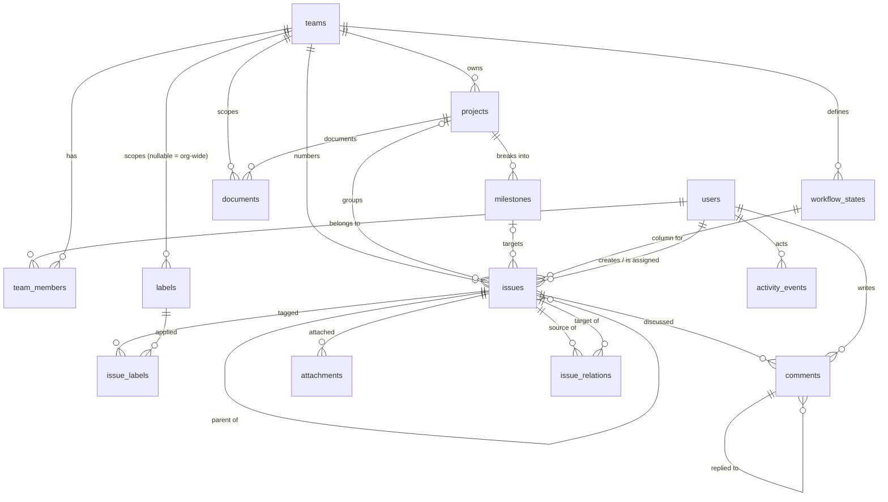

# Database design

PostgreSQL 18, EF Core 10 via Npgsql. One database, one schema (`public`), 24 tables plus EF's migration history: 13 domain
tables, 7 from ASP.NET Core Identity, 4 from OpenIddict.

## Conventions

| Convention | Why |
| --- | --- |
| `snake_case` tables and columns | On-prem operators query this database by hand. Applied model-wide, so Identity's `AspNetUsers` becomes `users` and OpenIddict's tables follow suit. |
| UUIDv7 primary keys (`Guid.CreateVersion7()`) | Sortable by creation time, so inserts stay at the right edge of the B-tree instead of scattering writes the way UUIDv4 does. Clients can still mint ids offline. The columns are `uuid`; the API base58-encodes them on the way out and decodes on the way in, so a value seen in `psql` and the same one seen in a response look nothing alike. |
| `timestamptz` everywhere | `DateTimeOffset` maps to it natively. No local-time columns exist. |
| `date` for calendar fields | `start_date`, `target_date` and `due_date` are `DateOnly` — a due date has no timezone. |
| Enums stored as `integer` | Compact and orderable, which `priority` needs (`ORDER BY priority` must put Urgent first). The API translates them to names on the wire, so no client sees the numbers. |
| `rank` columns, `COLLATE "C"` | Every hand-ordered list (board columns, issues within a column, projects, milestones) is ordered by a lexicographic rank key such as `a0V`. The keys sort byte-wise; the database default `en_US.utf8` would put `a0a` before `a0V`. See [architecture](architecture.md#order-is-a-lexicographic-rank-key). |
| `archived_at` instead of deletion | Work products keep their history and their inbound references. Hard delete exists but requires team-lead authority. |
| `updated_at` as concurrency token | Every UPDATE carries `WHERE updated_at = @original`; a stale write returns 409 rather than silently winning. |

## Entity relationships



## Tables

### Identity and access

| Table | Notes |
| --- | --- |
| `users` | `IdentityUser<Guid>` plus `display_name`, `avatar_url`, `time_zone`, `is_active`, `last_seen_at`. Users are deactivated, never deleted, so authored content keeps a real author. |
| `roles`, `user_roles`, `role_claims`, `user_claims`, `user_logins`, `user_tokens` | Standard Identity, renamed. Exactly one role per user is expected: `owner`, `admin`, `member`, `guest`. |
| `team_members` | Composite PK `(team_id, user_id)` and a `role` column (`Viewer` / `Member` / `Lead`). The join *is* the permission grant. |

### Work

| Table | Key columns | Notes |
| --- | --- | --- |
| `teams` | `key` (unique, ≤8 chars), `issue_counter`, `is_private` | `key` prefixes every issue: `ENG-42`. `issue_counter` is bumped by an atomic `UPDATE … RETURNING`. |
| `workflow_states` | `team_id`, `name`, `type`, `rank`, `is_default` | Board columns. Teams rename and reorder freely; `type` (Backlog/Unstarted/Started/Completed/Canceled) is the stable meaning behind the name, so "is this done?" survives a rename. |
| `labels` | `team_id` **nullable**, `name`, `color` | `NULL` team means organisation-wide. |
| `projects` | `team_id`, `name`, `status`, `health`, `lead_user_id`, `start_date`, `target_date`, `rank` | Progress is **not** stored; it is counted from issues at read time so it cannot drift. |
| `milestones` | `project_id`, `name`, `target_date`, `status`, `rank` | Ordered checkpoints. Deleting one leaves its issues in the project. |
| `documents` | `team_id`, `project_id` nullable, `title`, `content` | Markdown project documentation. Always team-scoped so permissions resolve without walking to the project. |
| `issues` | `team_id`, `number`, `state_id`, `priority`, `assignee_id`, `project_id`, `milestone_id`, `parent_id`, `rank` | The unit of work. `(team_id, number)` is unique. Lifecycle stamps (`started_at`, `completed_at`, `canceled_at`) are driven by the target state's `type`. |
| `issue_labels` | Composite PK `(issue_id, label_id)` | |
| `issue_relations` | `source_issue_id`, `target_issue_id`, `type` | Stored once, in one direction. "A blocks B" is not duplicated as "B blocked by A"; the inverse is projected when reading B. |
| `comments` | `issue_id`, `author_id`, `body`, `parent_comment_id`, `edited_at` | One level of threading. Deleting a parent cascades to its replies. |
| `attachments` | `issue_id`, `file_name`, `content_type`, `size_bytes`, `storage_uri` | Metadata only — bytes live wherever `storage_uri` points. |
| `activity_events` | `entity_type`, `entity_id`, `action`, `data` (`jsonb`), denormalised `team_id`/`project_id`/`issue_id` | Append-only audit trail. |

## Referential behaviour

Chosen per relationship, because "cascade everywhere" quietly destroys work:

| Relationship | On delete | Reasoning |
| --- | --- | --- |
| team → issues, projects, states, labels, members | `CASCADE` | Deleting a team really does mean all of it. Teams archive by default. |
| issue → state | `RESTRICT` | A column cannot be removed while issues sit in it; the API asks you to move them first. |
| issue → project, milestone | `SET NULL` | Dropping a project must not delete the work done for it. |
| issue → parent | `SET NULL` | Sub-issues get promoted to top level, not destroyed. |
| issue → assignee | `SET NULL` | People leave. |
| issue → creator, comment → author | `RESTRICT` | Authorship is not erasable; deactivate the user instead. |
| project → lead | `SET NULL` | |
| comment → parent comment | `CASCADE` | A reply without its question is noise. |
| issue → comments, attachments, relations, labels | `CASCADE` | These have no meaning without their issue. |

## Indexes

Beyond primary keys and the implicit foreign-key indexes:

| Index | Serves |
| --- | --- |
| `ix_teams_key` (unique) | Issue-key lookups (`ENG-42`) and key collision checks. |
| `ix_issues_team_id_number` (unique) | The identity of an issue, and the numbering guarantee. |
| `ix_issues_team_id_state_id_rank` | The board query: one team, one column, in rank order. |
| `ix_issues_updated_at` | Delta sync — `?updatedSince=` for clients that were offline. |
| `ix_issues_title` (GIN, `gin_trgm_ops`) | `ILIKE '%text%'` search without a sequential scan. Same on `documents.title`. |
| `ix_projects_team_id_status`, `ix_projects_target_date` | Project lists and timeline views. |
| `ix_milestones_project_id_rank` | Ordered milestone lists. Likewise `ix_projects_team_id_rank` and `ix_workflow_states_team_id_rank`. |
| `ix_labels_team_id_name` (unique) | Name uniqueness within a team. |
| `ix_labels_org_name` (unique, `WHERE team_id IS NULL`) | Postgres treats NULLs as distinct, so the composite index above would happily allow two organisation-wide labels called `bug`. This partial index closes that. |
| `ix_issue_relations_source_target_type` (unique) | Prevents duplicate relations. |
| `ix_activity_events_{issue,team,project}_id_created_at` | The three ways the feed is read, newest first. |
| `ix_comments_issue_id_created_at` | Comment threads in order. |

`pg_trgm` is the only extension required; the migration creates it.

## Migrations

```bash
# add one
dotnet ef migrations add <Name> \
  --project src/Planner.Infrastructure \
  --startup-project src/Planner.Infrastructure \
  --output-dir Migrations

# script it for a DBA instead of auto-applying
dotnet ef migrations script --idempotent \
  --project src/Planner.Infrastructure \
  --startup-project src/Planner.Infrastructure
```

`DesignTimeDbContextFactory` means the tooling never needs the API to boot or a live database to
connect to. It reads `ConnectionStrings__Planner` from the environment, defaulting to
`localhost:5432`.

The API applies pending migrations at startup when `Planner__Database__AutoMigrate` is `true`, which
is what makes `docker compose up` sufficient for a fresh install.
